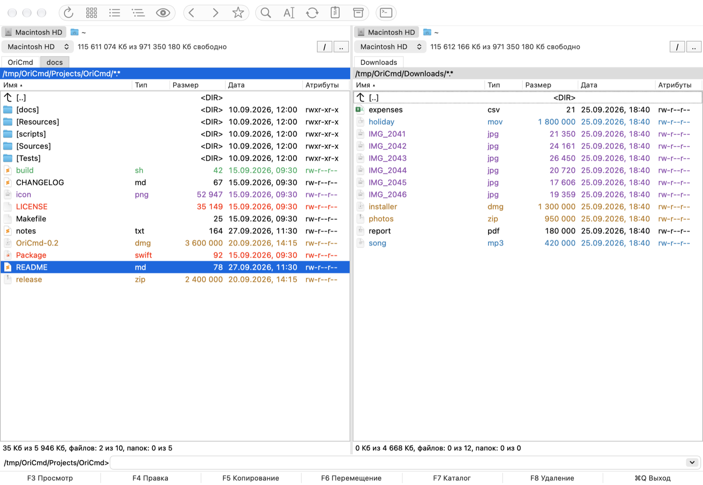
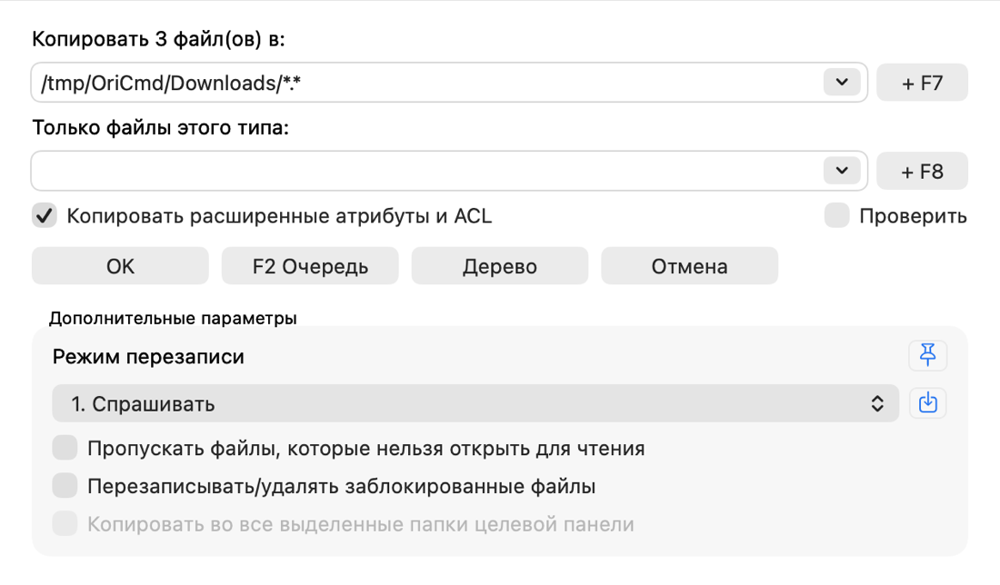
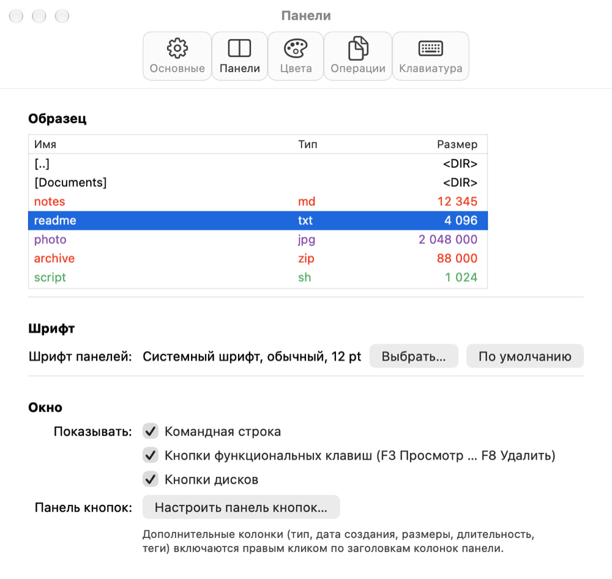
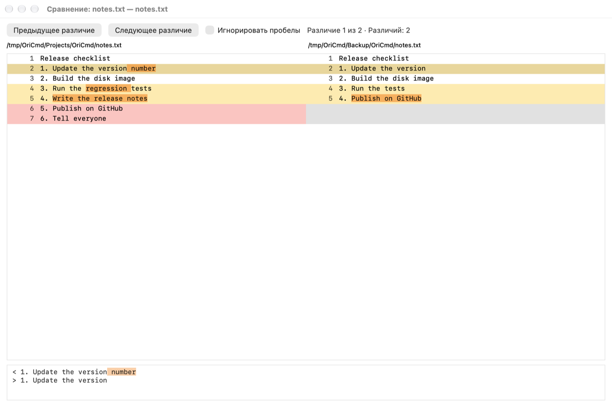
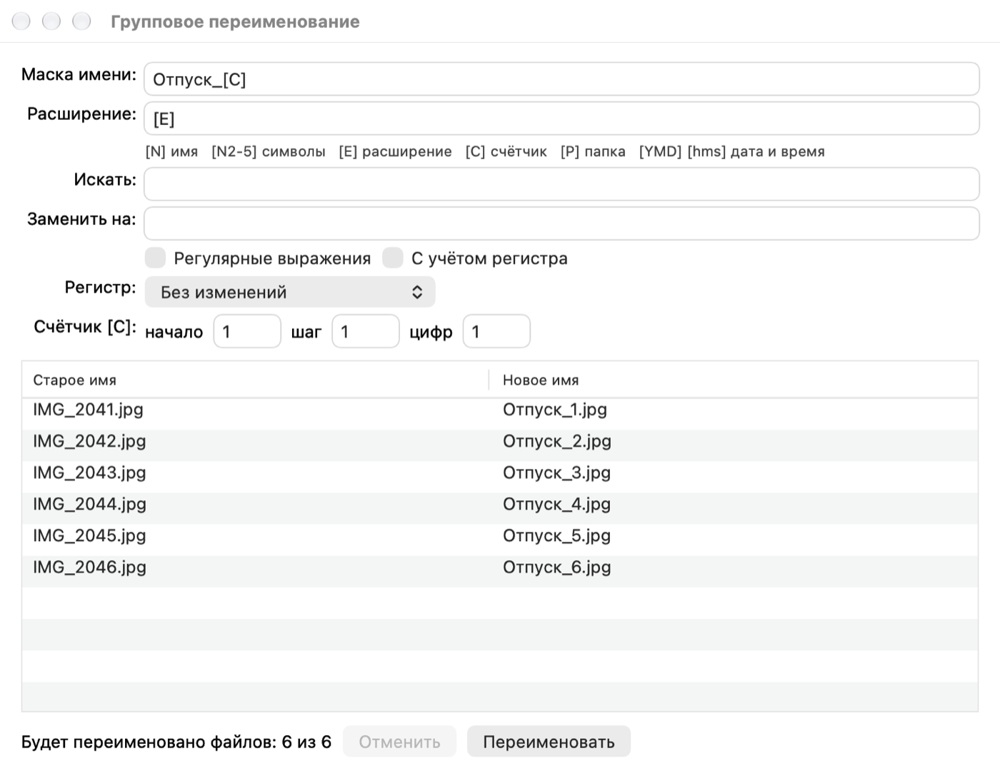
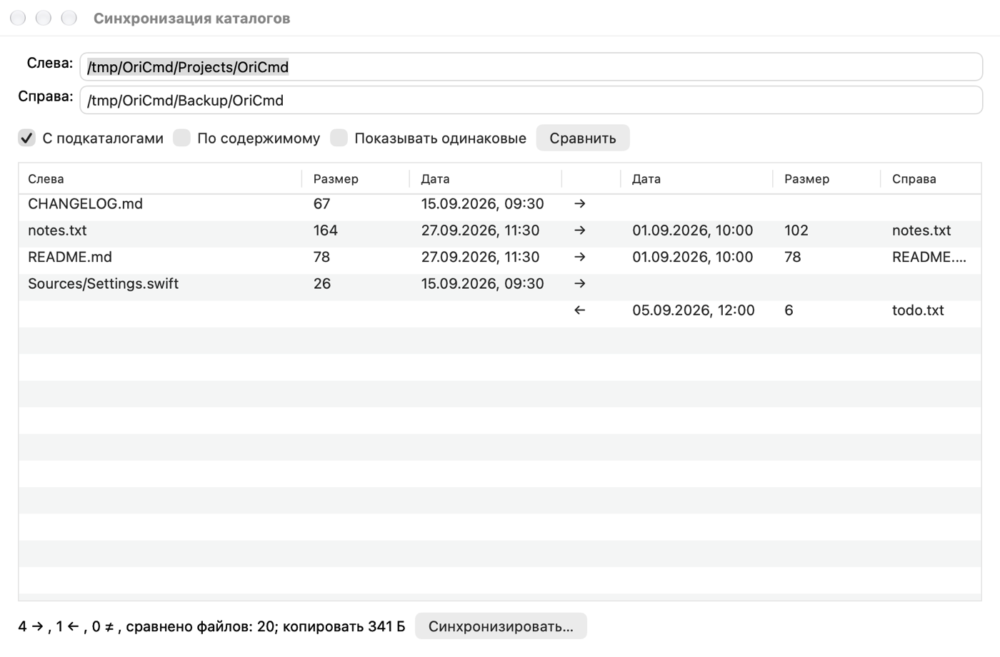

# OriCmd

[English](README.md) | **Русский**

Двухпанельный файловый менеджер для macOS с привычным видом: две панели,
кнопки F-клавиш внизу, командная строка и полное управление с клавиатуры —
всё на своих местах. Стандартные сочетания macOS (`⌘C`, `⌘V`, `⌘Q`, `⌘W`, …)
при этом работают как обычно.



## Возможности

- **Панели:** вкладки, история, избранные каталоги, дерево, фильтры, быстрый
  поиск; подробный и краткий вид, эскизы, дополнительные колонки, цвета файлов
  по маске.
- **Копирование и перемещение:** очередь и работа в фоне, фильтр по типам
  файлов, маски имён, режимы перезаписи, проверка после копирования.
- **Архивы как папки:** zip, tar, 7z и другие — просмотр, распаковка,
  упаковка, изменение прямо в архиве.
- **Серверы в панели:** SFTP (через системный ssh, с ключами и паролями),
  FTP/FTPS, сохранённые соединения; smb, afp, NFS, WebDAV — как тома.
- **Инструменты:** просмотр текста, hex и Quick Look (`F3`), сравнение файлов
  по содержимому, синхронизация каталогов, групповое переименование, поиск
  файлов, контрольные суммы, атрибуты.
- **Под себя:** свои сочетания клавиш (в том числе импорт из `wincmd.ini`),
  меню «Запуск», программы для `Enter`/`F3`/`F4` по маске, настраиваемая
  панель кнопок.
- Английский и русский интерфейс, автообновление с GitHub.

## Скриншоты

| | |
|---|---|
| <br>Копирование (`F5`): фильтр, маски, режимы перезаписи | <br>Настройки с образцом панели |
| <br>Сравнение файлов по содержимому | <br>Групповое переименование (`Ctrl+M`) |
| <br>Синхронизация каталогов | |

Скриншоты пересобираются скриптом `scripts/screenshots.sh` на демо-папках
(английские — в `docs/screenshots/en`, русские — в `docs/screenshots/ru`).

## Установка

Готовые образы — на странице [Releases](https://github.com/mmag/OriCmd/releases).
Образ можно собрать и самому (универсальное приложение для Apple Silicon и
Intel, macOS 14+):

```sh
scripts/make-dmg.sh        # → build/OriCmd-<версия>.dmg
```

Откройте образ и перетащите OriCmd в «Программы». Приложение подписано
ad-hoc, без сертификата Apple, поэтому при первом запуске macOS его не
откроет: нажмите на OriCmd правой кнопкой → «Открыть» → «Открыть» (или
System Settings → Privacy & Security → «Open Anyway»). Либо снимите карантин:

```sh
xattr -dr com.apple.quarantine /Applications/OriCmd.app
```

Дальше OriCmd обновляется сам: раз в день (выключается в настройках) и по
«OriCmd → Проверить обновления…» он смотрит последний релиз на GitHub, скачивает
образ, заменяет приложение и перезапускается. Обновление не попадает в
карантин, так что повторно разрешать запуск не нужно.

## Сборка

Требуется macOS 14+ и Xcode.

```sh
xcodebuild -project OriCmd.xcodeproj -scheme OriCmd -configuration Debug build
```

Иконка рисуется скриптом `swift scripts/make-icon.swift`.

## Клавиши

F-клавиши на Mac по умолчанию управляют яркостью, звуком и т. п. Нажимайте их
с `fn` или включите «Use F1, F2, etc. keys as standard function keys» в
System Settings → Keyboard.

У команд есть внутренние имена (`cm_Copy`, `cm_RenMov`, …), совместимые с
`wincmd.ini`; все они доступны из меню. В скобках — дополнительные сочетания в
стиле macOS.

Сочетания привязаны к физическим клавишам: на русской раскладке
`Ctrl+D`, `Ctrl+B`, `Ctrl+U` и т. п. работают так же, как на английской.

### Панели и навигация

| Клавиша | Действие |
|---|---|
| `↑` `↓` `PgUp` `PgDn` `Home` `End` | Перемещение курсора |
| `Enter`, двойной клик (`⌘↓`) | Войти в папку / открыть файл |
| `Backspace`, `Ctrl+PgUp` (`⌘↑`) | Родительская папка |
| `Ctrl+PgDn` | Войти внутрь пакета (`.app` и т. п.) |
| `Tab` | Переключить панель |
| `Alt+←` / `Alt+→` (`⌘[` / `⌘]`) | Назад / вперёд по истории папок |
| `Alt+↓` | Список недавних папок |
| `Ctrl+←` / `Ctrl+→` (`⌥⌘←` / `⌥⌘→`) | Показать папку под курсором в левой / правой панели |
| `Alt+F1` / `Alt+F2` | Список томов левой / правой панели |
| `Ctrl+\` | Корень тома |
| `⌘T` / `⌘W` | Новая вкладка / закрыть вкладку |
| `Ctrl+Tab` / `Ctrl+Shift+Tab` (`⇧⌘]` / `⇧⌘[`) | Следующая / предыдущая вкладка |
| `Ctrl+↑` (`⌥⌘↑`) | Открыть папку под курсором в новой вкладке |
| `Ctrl+D` (`⌘D`) | Избранные каталоги (Hotlist): переход, добавить/убрать текущий |
| `Alt+`буква, `Ctrl+Alt+`буква | Быстрый поиск по имени (`↑`/`↓` — другие совпадения, `*` в начале — поиск по подстроке) |
| `Alt+F7` (`⌘F`) | Поиск файлов по маске и тексту; «В панель» показывает найденное списком в панели, где с файлами работают все команды, `[..]` возвращает в папку поиска |
| `Ctrl+F1` / `Ctrl+F2` (`⌘1` / `⌘2`) | Краткий (Brief) / подробный (Full) вид |
| `Ctrl+Shift+F1` (`⌘4`) | Эскизы (превью Quick Look) |
| Правый клик по заголовку колонок | Дополнительные колонки: тип файла, дата создания, размеры картинки, длительность, теги Finder (сортируются кликом, как и остальные) |
| `Ctrl+F8` (`⌘3`) | Дерево каталогов; соседняя панель показывает выбранную папку |
| `Shift+F2` | Сравнить каталоги: отметить в обеих панелях уникальные и более новые файлы |
| Команды → «Синхронная смена каталогов» | Вход в подпапку или переход вверх в одной панели повторяется в другой (если там есть такая папка) |
| Команды → Синхронизировать каталоги | Рекурсивное сравнение двух папок и копирование в выбранных направлениях (двойной клик или `Space` меняет направление) |
| `Ctrl+U` | Поменять панели местами |
| Команды → Левая = правая / Правая = левая | Открыть в одной панели папку другой |
| `⌘R` (`Ctrl+R`) | Перечитать папку (изменения отслеживаются и автоматически) |
| `⇧⌘.` | Показать / скрыть скрытые файлы |
| `Ctrl+F3` … `Ctrl+F6` (`⌃⌥⌘1` … `⌃⌥⌘4`) | Сортировка по имени, расширению, дате, размеру; повторно — обратный порядок. Клик по заголовку колонки делает то же |

`Ctrl+F1`…`Ctrl+F8`, `Ctrl+↑` и `Ctrl+←/→` по умолчанию заняты macOS (фокус на
Dock и строку меню, Mission Control, переключение Spaces). Их можно отключить в System Settings → Keyboard →
Keyboard Shortcuts либо пользоваться сочетаниями в скобках.

### Выделение

| Клавиша | Действие |
|---|---|
| `Space`, `Insert` | Отметить файл и перейти ниже; на папке — ещё и подсчитать её размер |
| `Alt+Shift+Enter` | Подсчитать размер всех папок |
| `Shift+↑/↓`, `Shift+PgUp/PgDn/Home/End` | Отметить диапазон |
| `⌘`+клик, `Shift`+клик | Отметить мышью |
| `+` / `−` | Отметить / снять группу по маске (`*.txt;*.md`) |
| `*` | Инвертировать отметку файлов |
| `Num /` | Восстановить предыдущее выделение |
| `⌘A` / `⌥⌘A` | Отметить всё / снять всё |
| `⌥+` / `⌥−` | Отметить / снять файлы с тем же расширением, что под курсором |
| Вид → Фильтр… | Показывать только файлы по маске (маска видна в строке пути) |
| `Ctrl+B` (`⌘B`) | «Ветвь»: все файлы папки и её подпапок одним списком |
| `Ctrl+S` | Быстрый фильтр: остаются имена, содержащие набранный текст; `Enter` оставляет фильтр, `Esc` снимает |

### Файловые операции

| Клавиша | Действие |
|---|---|
| `F3` | Просмотр (Lister): `1` текст, `3` hex, `7` Quick Look, `W` перенос строк, `N`/`P` следующий/предыдущий файл, `F7`/`⌘F` поиск, `F3`/`⇧F3` искать далее/назад, `Esc` закрыть |
| `F4` | Открыть в редакторе текста по умолчанию (или в программе из ассоциаций) |
| `Shift+F4` | Создать новый файл и открыть его в редакторе |
| `F5` | Копировать (по умолчанию — в другую панель) |
| `Shift+F5` | Копировать в ту же папку под другим именем |
| `F6` | Переместить / переименовать |
| `Shift+F6` | Переименовать на месте |
| `Ctrl+M` | Групповое переименование (Multi-Rename Tool): маски `[N]`, `[N2-5]`, `[E]`, `[C]`, `[P]`, `[YMD]`, `[hms]`, поиск и замена (в т. ч. регулярные выражения), регистр, предпросмотр и отмена |
| `F7` (`⇧⌘N`) | Новая папка (`a/b/c` создаёт вложенные) |
| `F8`, `Del` (`⌘⌫`) | Удалить в Корзину |
| `Shift+F8`, `Shift+Del` | Удалить навсегда |
| `Ctrl+Shift+F5` | Создать символическую ссылку (по умолчанию — в другой панели) |
| Файлы → Сравнить по содержимому | Два отмеченных файла или файлы под курсорами обеих панелей. Окно сравнения: строки выровнены, изменённые — жёлтые (отличающийся кусок подсвечен), удалённые — красные, добавленные — зелёные; `N`/`P` (`⌥↓`/`⌥↑`) — следующее/предыдущее различие, «Игнорировать пробелы», двоичные файлы сравниваются побайтно в hex |
| `⌘I` | Изменить атрибуты: права rwx, «скрытый», «защищённый», дата изменения (в т. ч. рекурсивно) |
| `Ctrl+Q` | Быстрый просмотр в соседней панели |
| `⌘C` / `⌘X` / `⌘V` (`Ctrl+C` / `Ctrl+X` / `Ctrl+V`) | Копировать / вырезать / вставить файлы (совместимо с Finder); вставка в ту же папку создаёт «имя copy» |
| `⌥⌘V` | Переместить файлы из буфера сюда |
| `⌥⌘C` | Скопировать полные пути выбранных файлов (Выделение → Копировать имена — только имена) |
| `⌘K` | Подключиться к серверу: `sftp://`, `ftp://`, `ftps://`, `ftpes://` открываются прямо в панели; smb, afp, nfs, WebDAV монтируются как том |
| `Ctrl+F` (`⇧⌘K`) | Сохранённые соединения (пароли — в связке ключей) |
| Сеть → Отключиться | Закрыть сервер в активной панели |
| `⌘E` | Извлечь съёмный или сетевой том активной панели |
| `Alt+F5` | Упаковать в архив (формат — по расширению: `.zip`, `.tar.gz`, `.tar.bz2`, `.tar.xz`, `.7z`) |
| `Alt+F9` | Распаковать выбранные архивы |
| Файлы → Создать файл контрольных сумм… | MD5 / SHA-1 / SHA-256 / SHA-512 для выделенного (формат `shasum`/`md5sum`) |
| Файлы → Проверить контрольные суммы | Проверка файла `.md5`/`.sha1`/`.sha256`/`.sha512` под курсором |

Длинные операции (копирование, перемещение, архивы) показывают прогресс;
кнопка «В фоне» переносит его в отдельное окно, и с панелями можно работать дальше.

#### Диалог копирования и перемещения (`F5` / `F6`)

- **Путь назначения** с маской имён: `папка/*.*` — имена как есть, `папка/*.bak` —
  сменить расширение, `папка/new_*.*` — добавить приставку; без маски и для
  одного файла — новое имя. Выпадающий список — список целей и недавние пути;
  `F7` (кнопка «+ F7») добавляет текущую папку в список целей или убирает из
  него, `⌃D` — выбрать из избранных каталогов, «Дерево» — выбрать папку.
- **Только файлы этого типа**: `*.jpg *.png` — только такие файлы (и в
  подпапках); после `|` — исключения: `*.* | *.bak .git/ node_modules/`; имя с
  `/` на конце — папка на любой глубине (`src/` — только папки `src` целиком).
  Папки, оставшиеся пустыми из-за фильтра, не создаются. `F8` (кнопка «+ F8») —
  сохранённые фильтры и примеры.
- **Копировать расширенные атрибуты и ACL** (метки, комментарии Finder, права
  доступа) — аналог «Copy NTFS permissions»; **Проверить** — после копирования
  сравнить каждый файл с оригиналом.
- Кнопки: **OK** (`Return`), **F2 Очередь** — операция встаёт в очередь и
  выполняется по одной в своём окне прогресса, **Дерево**, **Отмена** (`Esc`),
  **Параметры >>**. Правый клик по OK или F2 — выполнить перемещение вместо
  копирования (и наоборот).
- **Параметры >>**: режим перезаписи (спрашивать, заменить все, пропустить все,
  заменить более старые, автопереименование копируемых или существующих —
  `имя(2).ext`, копировать бо́льшие или меньшие), пропуск нечитаемых файлов,
  перезапись/удаление заблокированных файлов, копирование во все выделенные
  папки целевой панели. Кнопка с булавкой оставляет параметры раскрытыми,
  кнопка сохранения делает их значениями по умолчанию.

### Архивы

`Enter` или `Ctrl+PgDn` на архиве (zip, tar.\*, 7z, rar, iso, cab, …) открывает
его как папку. Внутри работают навигация, выделение, `F3`, `Enter` (файл
распаковывается во временную папку и открывается) и `F5` — распаковка
выбранного в другую панель. В архивы zip, tar, tar.gz, tar.bz2, tar.xz и 7z
можно и записывать: `F5`/`F6` в панель с открытым архивом упаковывают туда
файлы, внутри работают `F7`, `F8` и `Shift+F6` (архив пересобирается через
временную папку). rar, iso, cab и другие — только для чтения.

### Панель кнопок и кнопки дисков

Под заголовком окна — панель кнопок с частыми командами (обновить, виды,
история, избранное, поиск, групповое переименование, синхронизация, архивы,
Терминал). Её можно настроить: правый клик по ней → «Customize Toolbar…».
Над каждой панелью — кнопки дисков: системный том, домашняя папка и
подключённые тома (скрываются в настройках).

### Серверы (SFTP, FTP)

SFTP работает через системные `ssh`/`sftp`: учитываются `~/.ssh/config`
(алиасы, ProxyJump), ключи и ssh-agent; соединение с сервером одно и
переиспользуется, пароль или passphrase спрашиваются один раз. FTP/FTPS — через
системный `curl`. На сервере работают навигация, `F3`, `Enter`, `F5`/`F6` в обе
стороны (скачать/закачать), `F7`, `F8`, `Shift+F6`, вставка из буфера и
перетаскивание файлов в панель сервера. Копирование идёт пофайлово с прогрессом
в байтах (текущий файл и всего). По SFTP сохраняются права и даты файлов и
папок, по FTP — даты скачанных файлов.

### Мышь

Правый клик (или `Ctrl`+клик) — контекстное меню: открыть, открыть в программе,
просмотр, показать в Finder, буфер обмена, переименовать, удалить, упаковать,
а также системные «Службы». Файлы перетаскиваются между панелями, из Finder и в
Finder; по умолчанию копирование, с `⌘` — перемещение. Бросок на строку папки
кладёт файлы в неё.

### Командная строка

Буквы, набранные в панели, попадают в командную строку, а курсор остаётся в панели.

| Клавиша | Действие |
|---|---|
| `Enter` | Выполнить команду в текущей папке (login shell, без окна) |
| `Shift+Enter` | Выполнить в Terminal, окно остаётся открытым |
| `cd <путь>`, путь к папке | Сменить папку активной панели |
| `Ctrl+Enter` / `Ctrl+Shift+Enter` | Вставить имя / полный путь файла под курсором |
| `Esc` | Очистить командную строку |

## Цвета

Настройки → «Цвета»: цвет отмеченных файлов, курсора и текста под курсором,
чередование фона строк; образец панели сразу показывает результат. «Цвета
файлов…» раскрашивают имена по маскам (архивы, картинки, скрипты — есть
готовые примеры).

## Свои клавиши

Настройки → «Клавиатура» → «Горячие клавиши…»: любую команду `cm_*` можно
назначить на своё сочетание (двойной клик по строке и нажатие клавиш). Кнопка
«Импорт wincmd.ini…» переносит назначения из секции `[Shortcuts]` файла
`wincmd.ini` — они добавляются к стандартным клавишам.

## Меню «Запуск»

Свои команды: «Запуск → Изменить меню «Запуск»…». Команда выполняется в оболочке в папке активной панели; параметры
`%P` (папка активной панели), `%N` (файл под курсором), `%S` (выделенные файлы),
`%T` / `%M` (папка и файл под курсором другой панели) подставляются уже
экранированными. У команды может быть своё сочетание клавиш (`CM+E` — ⌃⌘E) и
запуск в Терминале; через «Настроить панель кнопок…» команды выносятся на панель.

## Внутренние ассоциации

«Файлы → Внутренние ассоциации…» (или кнопка в настройках): для маски
(`*.swift;*.json`) задаются свои программы
для `Enter`, `F3` и `F4`. Программа — приложение (кнопка «Приложение…») или
команда оболочки: `%P` — папка файла, `%N` — его имя; без параметров путь к
файлу добавляется в конец (`code -g`, `qlmanage -p`). Берётся первая подходящая
запись, где задана программа для этой клавиши; иначе — стандартное поведение.
Маска `*` в конце списка задаёт программу для всех остальных файлов.

## Настройки

«OriCmd → Настройки…» (`⌘,`) — окно с вкладками:

- **Основные** — язык интерфейса, автоматическая проверка обновлений.
- **Панели** — образец панели, шрифт, командная строка, кнопки F-клавиш и
  дисков, настройка панели кнопок.
- **Цвета** — образец панели, цвета отмеченных файлов и курсора, чередование
  строк, цвета по маске файлов.
- **Операции** — значения по умолчанию для диалога копирования (режим
  перезаписи, проверка, атрибуты), подтверждение удаления в Корзину,
  внутренние ассоциации, меню «Запуск».
- **Клавиатура** — режим быстрого поиска, свои сочетания клавиш, подсказка про
  F-клавиши на Mac.

## Язык интерфейса

Английский и русский. По умолчанию — как в системе; в «Настройки → Основные»
язык выбирается только для OriCmd (кнопка «Перезапустить» сразу применяет его).

## Разработка

Debug-сборка умеет прогонять сценарии нажатий и сохранять снимок окна — см.
`OriCmd/App/DebugAutomation.swift`. Сценарии работают только с явно заданными
тестовыми папками (`ORICMD_LEFT`, `ORICMD_RIGHT`).

Релиз: `scripts/release.sh 0.2 [notes.md]` — ставит версию, собирает образ,
коммитит, ставит тег `v0.2`, отправляет в GitHub и публикует релиз с образом
(нужен `gh auth login`).

## Лицензия

GPL-3.0 — см. [LICENSE](LICENSE).

OriCmd не связан с Ghisler Software GmbH. Total Commander — торговая марка
её владельца.
